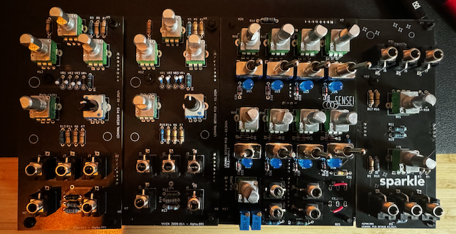
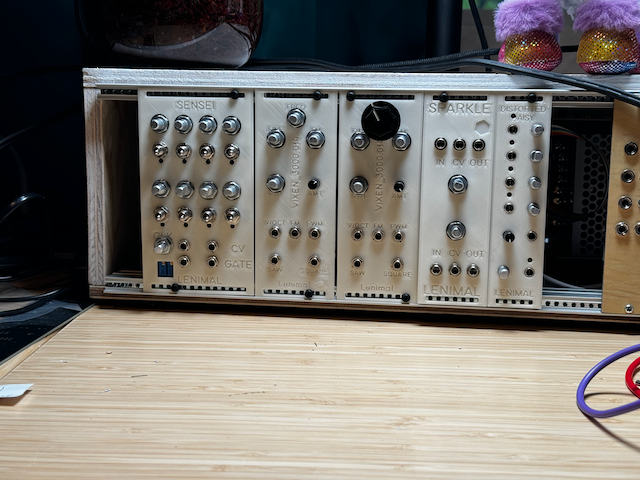
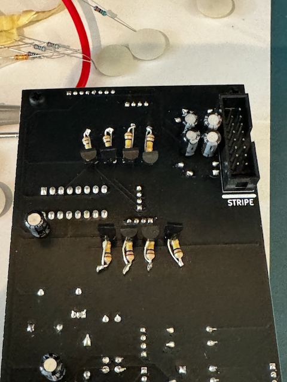
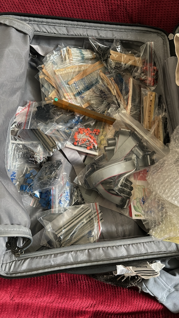
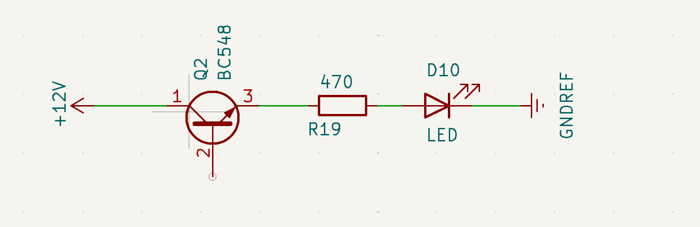

# Building a Eurorack synth

This is a collection of notes and resources for building a Eurorack synth. 
I'm not an expert, but I'm learning as I go and I'm happy to share what I've learned.

[First Jam Session](https://youtu.be/sQ6iWkeZPVc)

(First version without panels)

(First version with 3D printed panels, I'm still missing knobs)

## Disclaimer

I am not responsible for any damage to any of your modules. The modules
within this repository have been tested and built by myself and used only
with the other modules in this system. 

There is a chance they work well with other off-the-shelf modules, 
but I do not own any, so I can not test it out. 
If you proceed to copy or use any file within this repository, **you are doing this at your own risk**.

These modules are also not perfect 1v/oct or temperature controlled. This project should be 
seen as a fun hobby project and not as professional advice on how to build synthesisers.

## The story

Since young, I have always been interested in 2 things: Electronics & Music. I have played many
instruments over the years (drums, guitar, and a bit of piano). When I was a teenager, I got into
electronic music production. I DJ'ed (as Lenimal) for about 10 years in and around Belgium.

I moved into
[software engineering](https://medium.com/forto-tech-blog/how-being-a-dj-prepared-me-to-become-a-staff-engineer-5712df294461) 
after my studies in Film. 
Not having a computer science or electronics degree, I always felt that I needed to 
explore the connection with the hardware on which my software ran. 
I started following a YouTube series by 
[Ben Eater](https://www.youtube.com/watch?v=HyznrdDSSGM&list=PLowKtXNTBypGqImE405J2565dvjafglHU),
showing how to build an 8-bit computer on breadboards. 
I got pretty far until my cat, being the cat he is, decided that
the computer would look better on the ground, destroying most of the connections.
The motivation to continue was lost after seeing the work it would take to repair it.

I learned quite a lot about electronics during that process! While visiting family in the States,
I got the opportunity to visit the MOOG factory in Ashville, NC. I didn't buy a MOOG (sadly enough), but I got the
[MFOS book](https://shop.musicfromouterspace.com/cart/ray-wilson-make-analog-synthesizers) on
how to build an analog synth.

After immersing myself in the MFOS book, I was filled with a sense of determination. 
I read the book cover to cover at least four times, absorbing every detail.
It was then that I made a firm decision-I was going to build my own synthesizer!

I started watching more in-depth tutorials on YouTube and came across
[Moritz Klein's](https://www.youtube.com/@MoritzKlein0) channel. 
He explains the process in great detail and I could follow along at home. (Thank you, Mortiz!)

I still had ample chips, resistors, and capacitors from my previous 8-bit computer build,
so I started looking into the more specialized equipment I needed. 
It was clear very soon that I needed a reasonable Oscilloscope and some other things (described below).

Once I had collected all the needed items, I made a goal. In 2024, I would build a modular
synth from scratch. It took me 3-4 months to get the first 5 modules:

- VCO
- Sequencer
- VCA
- Envelope Generator
- Active Mixer

Of course, they didn't turn out perfect. When I ordered the PCBs and started soldering, I found many issues.
Some on the schematic (like I connected the wrong inputs on the op-amp on the EG) and others on the PCB
(my first attempt at an SPDT switch footprint didn't fit my switches at all).

(example of a hack on the V1 boards because I forgot the resistors)

As I'm learning, I will keep updating the modules in this repository. I hope it inspires
and helps others create awesome modules & start their adventure into DIY Synths!

As my creativity ends with designing PCB's, I call upon my (very beautiful) wife to name the modules, 
this is why they might sound like the name of unicorns.

## Getting Started

### What do you need?

I didn't have much electronic equipment, so I started saving and purchasing as I got the money:

- Oscilloscope (Rigol DS1054Z)
- Bench Dual Power Supply (Komerci QJ3005EIII)
- Solder Station (Hakko FX888D-BY)
- Precision measuring tool (Digital Calliper)

I already had most of the other small tools, but here is a list of my most used tools:

- Precision Pliers (KNIPEX 78 61 125)
- Automatic Wire Stripper (KNIPEX 12 62 180)
- ESD Tweezers (KNIPEX 92 28 69, don't get cheap ones)
- de-soldering pump (It's not easy to use, but has saved my PCB's many times already!)
- breadboards (get enough if you plan to keep your builds for debugging)

## Components

The next step was to start sourcing components, because I did not want to just order kits.

I started by watching lots of YouTube and getting schematics from the internet. That gave me a
good idea of the main things I would need. Here are the most used components I have.
The quantity is just a guideline for how many I got to get started.

Most of the items I got in bulk while travelling in Asia. I kept space in my suitcase for these components as I could
get them pretty cheap there. I didn't have any problems with flying when checking them in, and no issues with customs.
(this is not a promise that you will not have problems, always read guidelines and regulations of the country you are flying from/to)

(Suitcase coming back from Shanghai)

### Resistors

I started with a big set of lots of different values to start with, and ordered in bulk when I needed them.
Here is the list of my most used resistor values:

- 1M (50x)
- 100K (200x)
- 68K (100x)
- 47K (100x)
- 33K (50x)
- 22K (50x)
- 14K (50x)
- 10K (100x)
- 4.7K (100x)
- 1K (100x)
- 470R (50x)
- 200R (50x)
- 100R (100x)
- 10R (100x)

### Potentiometers

I have been looking for cheap (but good) ones that fit on PCB's vertically for a long time.
The best I can found are the ALPHA 9mm (I buy them on thonk.co.uk). You can find some on digiKey, 
but the ALPHA's are my recomendation. I bought some with a D-shaft, and others just as a long shaft.

- A1M (10x)
- B250K (10x)
- A250K (10x)
- B100K (50x)
- A100K (10x)
- B50K (10x)

### Diodes

- 1N1418 [Signal] (200x) Used for general-purpose direction of current
- 1N5819 [Schottky] (100x) Used for power guards

### Capacitors

It's also good to have some of every value. I got a box of electrolytic, ceramic and film

For the film capacitor's I try to use [WIMA](https://www.wima.de/en/our-product-range/capacitors-in-pcm-2-5/mks-02/) Caps

- 1uF MKS
- 0.1uF MKS
- 2.2nf MKS
- 47uF electrolytic
- 0.1uf electrolytic

... you might want to buy just a set of these

### Transistors

There are some general NPN and PNP transistors you can get, I mainly got some variety that I found on videos and blogs:

- BC558 (PNP, 25x)
- BC548 (NPN, 50X)
- 2N2904 (PNP, 25x)

### IC's

- TL072 (25x) [operational amplifier]
- TL074 (50x) [operational amplifier]
- CD40106 (10x) [Hex Schmidt trigger]
- CD4016 [decade counter]
- CD4040 [binary counter]

## Schematics & PCB creation

I use [kiCad](https://www.kicad.org/), open-source software to design all my schematics. It's pretty easy to get a hang
of it and also has a built in PCB editor. You can also design custom footprints for components they
don't have in their (pretty big) library. I have included some of my footprints/symbols in this repo.

### Design tips

#### Testing Points

For my first PCB, I had some testing points and that made it easier to debug. I forgot them for all the other
ones and had a really bad time. I had to keep prodding resistor legs to understand what was going on. Always add
testing points to your schematic & PCB.

#### Measure

Always measure 20 times when creating a footprint. It's really annoying when you have ordered your new
PCB and the component just does not fit. I tried to make a SPDT switch footprint, and they just did not fit well.

#### PIN numbers

Make sure when you are giving the pins a number, the correspond to the correct number on the whole. I had the issue
with my SPDT switch, that they just didn't work. I got the holes mixed up and ended with the wrong pin out.

#### LED's

When using an LED, never connect it directly to an IC to drive it. Always use a transistor to drive the LED.
This is important because you don't want to burn your IC because there is too much current flowing over your LED.

#### Header pins

If you are following my schematics, you will see I use header/socket pins to connect my boards.
I first started with the 2.00mm pins. I could not easily find tall sockets, so I ended having to
always stack 2 on top of eachother, this was not super stable in the end, and I had to solder 
all the cap's to the back of the board because I didn't want to use 3 stacked socket pins.

#### Mounting holes

Make sure you place 4 mounting holes on your board, and that they match the coordinates of the
top board. I got simple 3mm & 2mm spacers from nylon.

## Front Panels

I have a 3D printer accessible at the office, so I use it to build and prototype the
designs. At some point I might turn to a professional milling company but for now, it works well.
I use Fusion 360 for the designs (there is a free non-commercial license!).

## Modules

### Voltage Controlled Oscillators

- [VIXEN 3000.014](modules/voltage-controlled-oscillators/1-vixen/README.md)

### Voltage Controlled Amplifiers

- [Sparkle](modules/voltage-controlled-oscillators/1-vixen/README.md)

### Sequencer

- [Sensei](modules/voltage-controlled-oscillators/1-vixen/README.md)

### Envelope Generator

- [Scribble](modules/voltage-controlled-oscillators/1-vixen/README.md)

### Active Mixer

- [Distorted Daisy](modules/voltage-controlled-oscillators/1-vixen/README.md)

## Next

- [VCO: CEM 3340](modules/voltage-controlled-oscillators/2-cem-3340/README.md)
- [LFO](modules/voltage-controlled-oscillators/3-lfo/README.md)
- [Digital Sequencer](./modules/sequencers/2-digital/README.md)

- [Filter: CEM 3320](modules/filters/1-cem-3320/README.md)
- [Filter: Ladder](modules/filters/2-ladder/README.md)
- [Digital Quantizer](modules/utility/1-quantizer/README.md)
- [Midi to CV](modules/utility/1-midi-2-cv/README.md)

- Binary counter (or clock splitter)
- Simple Mult
- Simple Math

- [Kick](modules/drum-kit/1-kicks/README.md)
- [Snare/clap](modules/drum-kit/2-claps/README.md)
- [HiHat](modules/drum-kit/3-hats/README.md)

- Delay/Reverb (Analog/Spring)
- Delay/Reverb (Digital)
- Sample & Hold
- White/pink noise module

- Cool input device (keyboard or something similar)

### Tooling

- 1v/oct tuner (just 8 holes each 1v)
- SemiTone generator?