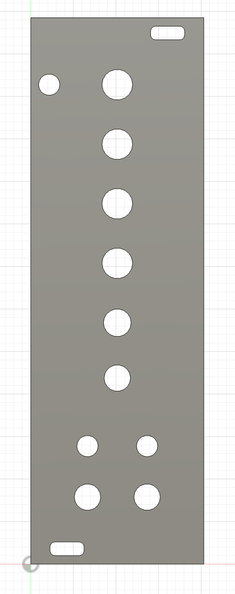

# Euro rack Panel Creator (or hole-driller)

This script is made for autodesk fusion and allows you to generate 3D printable euro rack panels with a script.

## Usage

1. Make a copy of the example.json file. The name of the file must match your module (example: `sparkle.json`)
2. Add the script to Autodesk Fusion
3. Run the script from the utilities menu
4. Enter your module name (same as your json file name)
5. Profit!

## Modification

By default, it will make the panels 2 mm thick. You can change the
value directly in the script to make them thicker.

I use the following hole diameter, but you can change this in the script as well.

```
"jacks": 0.62
"pots": 0.72
"switches": 0.65
"leds": 0.50
"sm_leds": 0.30
```

## Example (7555)

