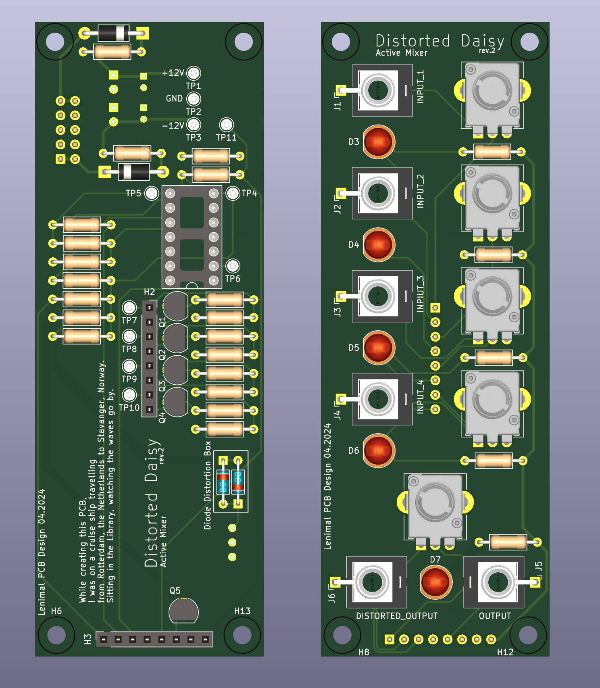
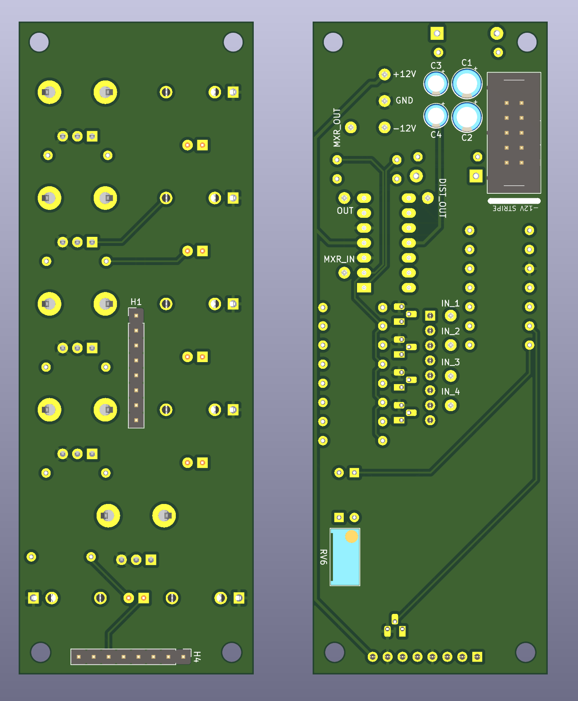

# Distorted Daisy
(8-step sequencer)

!! The current version has not been built or tested

## Current Version: 2

| Field  | status |
|--------|--------|
| Tested | No     |
| Built  | No     |
| Length | 111 mm |
| Width  | X mm   |

## Inputs

- Clock In (3.5mm)
- Clock Switch [internal/external] (switch)
- Control Voltage Level [high/low] (switch)
- Control Voltage [per step] (knob)
- Enable Gate [per step] (switch)
- Gate on bus pins [enable/disable] (header pins)
- CV on bus pins [enable/disable] (header pins)

## Output

- Gate Out (3.5mm)
- Control Voltage (1v/oct, I hope) (3.5mm)
- Clock Out (3.5mm)

## Build Guide

Schematics can be [found here](./img/distorted_daisy_schematic_a3.pdf)

- Potentiometers: I use the Alpha (D-shaft) 9mm fom THONKICONN (https://www.thonk.co.uk/shop/alpha-9mm-pots-dshaft/)
- Jacks: I use the PJ398SM from THONKICONN (https://www.thonk.co.uk/shop/thonkiconn/)
- Switch: I use the Mini toggle switch from THONKICONN (https://www.thonk.co.uk/shop/mini-toggle-switches/)
- All mounting holes are M3 (3.2mm), and pick an offset that you feel good with

### Bill Of Material

See [Bill Of Material](./BOM.csv) for a full list of material and where to solder the components

### Soldering

In general: use the Bill Of Material and solder each component. Start from the lower components and go to the higher ones.

## Images (3D)

## Previous versions & Issues

### Version: 1
PCB Tested: Yes

Built: Yes

Issues:
- Schematic was wrong and had inverted inputs on the TL074's
- 2mm sockets are a bit too small and required layering to make it high enough
- Capacitors were on the front, making the height of the bottom board too high