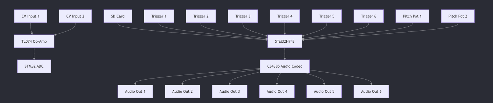

(AI generated content)

# README for Eurorack Sample Folder Player

## Overview

The Eurorack Sample Folder Player is a versatile module designed for modular synthesizer setups. It allows users to
trigger audio samples stored on an SD card, with pitch control for two channels and a simple interface for folder
navigation. The module is ideal for playing back drum sounds, basslines, and lead samples in a Eurorack environment.

---

## Features

- **6 Trigger Inputs**: Each trigger input plays a specific sample from the selected folder.
- **6 Audio Outputs**: Individual outputs for each triggered sample.
- **Binary Folder Display**: 4 LEDs represent the selected folder number (0-127) in binary.
- **Manual Folder Navigation**: Two buttons allow users to navigate between folders.
- **CV Folder Selection**: A CV input allows dynamic control of the selected folder.
- **Pitch Control**: Channels 1 and 2 support 1V/oct CV input and manual pitch adjustment via potentiometers.
- **Retrigger/One-Shot Mode**: A toggle switch allows users to choose between retriggering or one-shot playback modes.

---

## Functionality

1. **Trigger Inputs**:
    - 6 trigger inputs accept 0-12V signals.
    - A signal above 1.8V triggers the corresponding sample.
    - Each trigger input has an LED for visual feedback.

2. **Audio Outputs**:
    - 6 dedicated outputs (one per channel) deliver the audio signals.

3. **Folder Selection**:
    - The SD card contains folders numbered 0-127, each with 6 WAV files (1.wav to 6.wav).
    - Use the two navigation buttons to increment or decrement the folder number.
    - Alternatively, use the CV input to dynamically select a folder based on the input voltage.
    - The binary folder number is displayed via 4 LEDs.

4. **Pitch Control**:
    - Channels 1 and 2 support 1V/oct CV input (0-8V for 8 octaves).
    - Manual pitch adjustment is possible with dedicated potentiometers.
    - CV and manual adjustments are combined to determine the final pitch.

5. **Playback Modes**:
    - A toggle switch selects between retrigger and one-shot playback modes.

---

## Technical Specifications

- **Sample Rate**: 48kHz (preferred) or 44.1kHz.
- **Bit Depth**: 16-bit.
- **File Format**: WAV.
- **Voltage Ranges**:
    - CV Input (Folder Selection): 0-8V (mapped to folder numbers 0-127).
    - CV Input (Pitch): 0-8V (scaled to 0-3.3V for the ADC).
    - Trigger Input: 0-12V (threshold at 1.8V).
- **Power Supply**: Eurorack +/-12V rails.

## Block Diagram

Here’s a high-level design of how the system will be structured:


---

## Folder Structure

The SD card should have the following structure:

```
/0
  1.wav
  2.wav
  3.wav
  4.wav
  5.wav
  6.wav
/1
  1.wav
  2.wav
  3.wav
  4.wav
  5.wav
  6.wav
...
/127
  1.wav
  2.wav
  3.wav
  4.wav
  5.wav
  6.wav
```

---

## Assembly and Configuration

1. **Connect Power**:
    - Use the Eurorack power header to connect to +/-12V rails.

2. **Insert SD Card**:
    - Format the SD card as FAT32 and load the sample folders as per the structure above.

3. **Connect Inputs and Outputs**:
    - Patch trigger signals to the trigger inputs.
    - Connect audio outputs to your mixer or other modules.

4. **Adjust Pitch**:
    - Use CV input or potentiometers to control the pitch of channels 1 and 2.

5. **Select Folder**:
    - Use the navigation buttons or CV input to select the desired folder.

---

## Usage Notes

- Ensure all WAV files are properly formatted (16-bit, 48kHz or 44.1kHz).
- Avoid exceeding the voltage limits for CV and trigger inputs to prevent damage.

---

This README provides an overview of the module's functionality and setup. For further details, refer to the schematic
and firmware documentation.