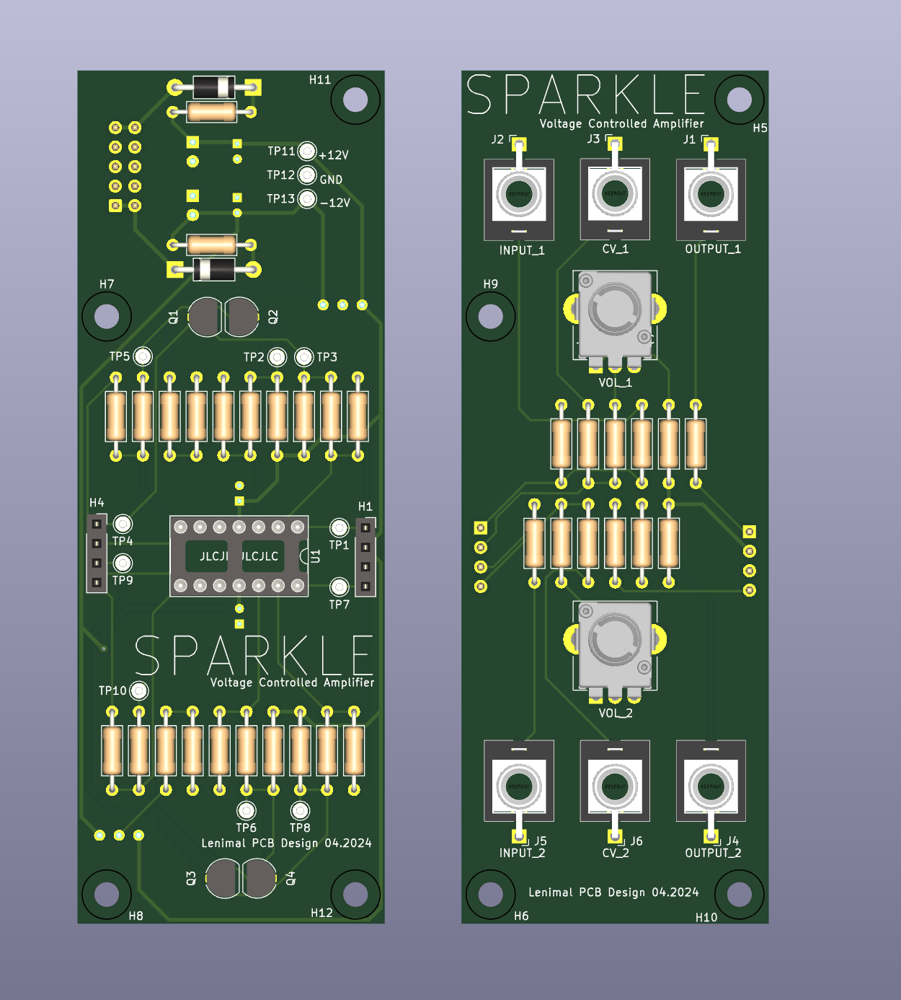
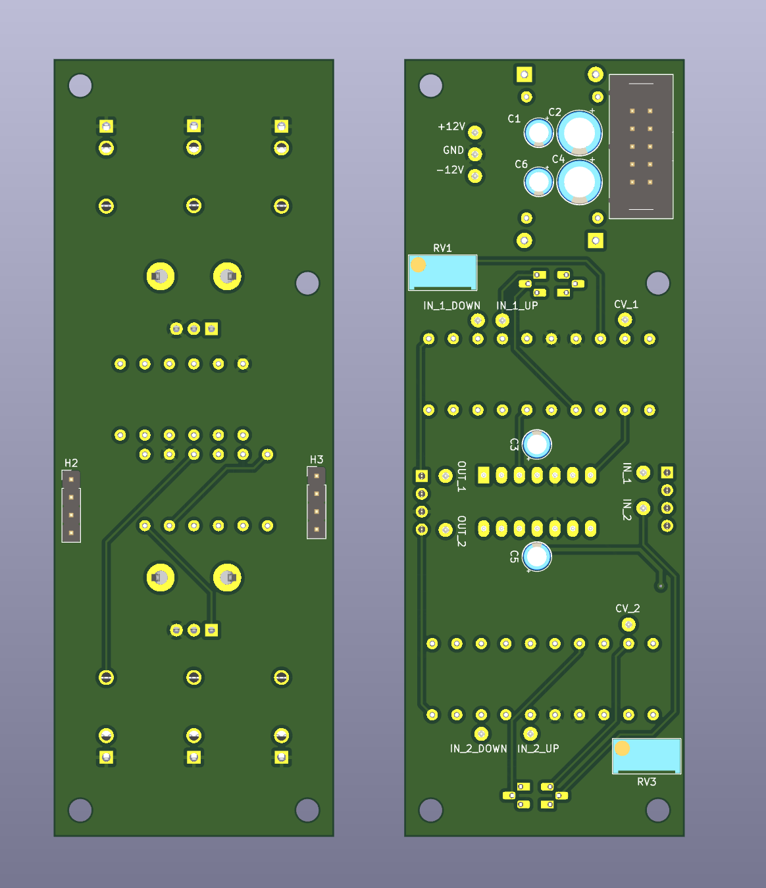

# Sparkle
(Voltage Controlled Amplifier)

#### Current Version: 2

## Inputs (2x)

| type | value  |
|------|--------|
| jack | input  |
| jack | CV     |
| knob | volume |

## Output (2x)

| type | value  |
|------|--------|
| jack | output |

## Bill Of Material

[IBOM](https://htmlpreview.github.io/?https://github.com/lennartquerter/euro-rack-synth/blob/main/modules/voltage-controlled-amplifiers/1-sparkle/ibom.html)

## Images

## Build Notes

### Version: 2
PCB Tested: Yes

Built: Yes

Issues:
- No issues found!

### Version: 1
PCB Tested: Yes

Built: Yes

Issues:
- 2mm sockets are a bit too small and required layering to make it high enough
- Capacitors were on the front, making the height of the bottom board too high

