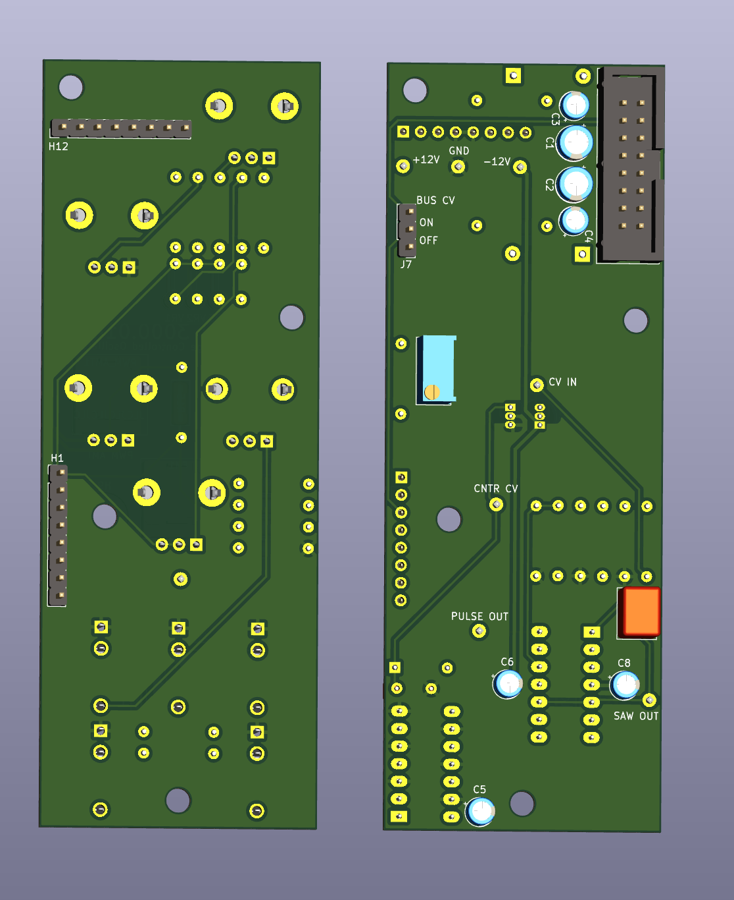
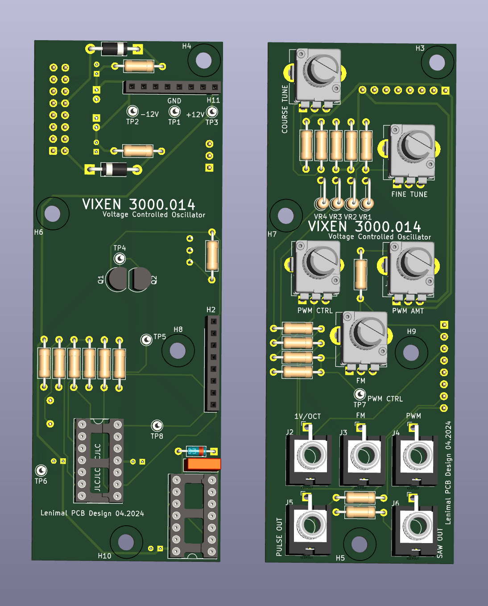

# Vixen
(Voltage Controlled Oscillator)

!! The current version has not been built or tested

## Current Version: 2

| Field  | status  |
|--------|---------|
| Tested | No      |
| Built  | No      |
| Length | 111 mm  |
| Width  | 40.3 mm |

## Inputs

- 1V/Oct (3.5mm)
- Frequency Modulation (3.5mm)
- PWM (3.5mm)
- Course Tuning (knob)
- Fine Tuning (knob)
- Frequency Modulation (knob)
- PWM Amount (knob)
- PWM Offset (knob)

## Output

- SAW (3.5mm)
- PULSE (3.5mm)

## Build Guide

Schematics can be [found here](./img/vixen_schematic_a3.pdf)

- Potentiometers: I use the Alpha (D-shaft) 9mm fom THONKICONN (https://www.thonk.co.uk/shop/alpha-9mm-pots-dshaft/)
- Jacks: I use the PJ398SM from THONKICONN (https://www.thonk.co.uk/shop/thonkiconn/)
- All mounting holes are M3 (3.2mm), and pick an offset that you feel good with

### Bill Of Material

See [Bill Of Material](./kiCad/BOM.csv) for a full list of material and where to solder the components

### Soldering

In general: use the Bill Of Material and solder each component. Start from the lower components and go to the higher ones.

## Images (3D)

## Previous versions & Issues

### Version: 1
PCB Tested: Yes

Built: Yes

Issues:
- Transistors not setup correctly
- 2mm sockets are a bit too small and required layering to make it high enough
- Capacitors were on the front, making the height of the bottom board too high